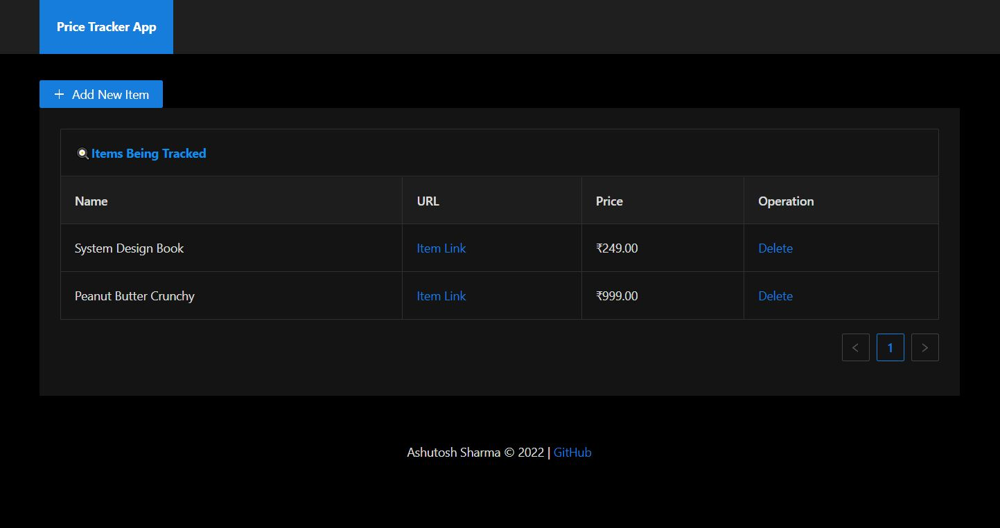
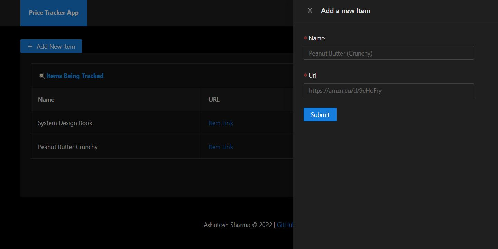

#  Price Tracker App

Track the Price of Products on E-commerce site(s) (like Amazon) and get Email notifications when the price drops.

---

## Local Setup

### Without Docker

##### MySQL

```
sudo apt install mysql-server
service mysql start
```

##### SuperTokens Core

```
https://supertokens.com/docs/passwordless/pre-built-ui/setup/core/without-docker
https://supertokens.com/blog/connect-supertokens-to-database
```

##### Client

```
cd client/

npm i
npm start
```

##### Server

```
cd server/

export NOTIFICATION_SENDER_EMAIL=<sender's email>
export NOTIFICATION_SENDER_PASS=<sender's pass>

npm i
npm run i:puppeteer:dep
npx prisma migrate resolve --applied 0_init
npx prisma migrate deploy
npm start
```

---

### With Docker

```
cd <ROOT of Project>

export NOTIFICATION_SENDER_EMAIL=<sender's email>
export NOTIFICATION_SENDER_PASS=<sender's pass>

docker-compose up --build
```

---

**For <sender's pass> checkout:** `https://myaccount.google.com/apppasswords`

---

## ScreenShots



